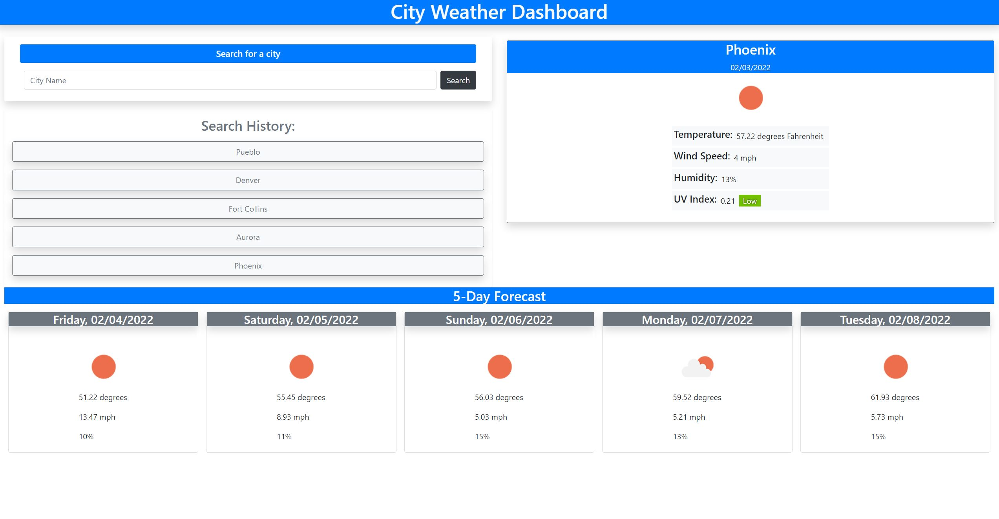

# City-Weather-App

## What it is
City Weather Dashboard is a weather app that will provide local weather for a given city, as well
as the forecast for the next 5 days.
It will allow storage of past city searches for quick access to your most frequently-searched
cities without repetitive typing.

## Screenshot

## Deployed Link

## Tools
* Bootstrap
* JQuery
* OpenWeather One Call API

## Author
Jonathan Williams 2022